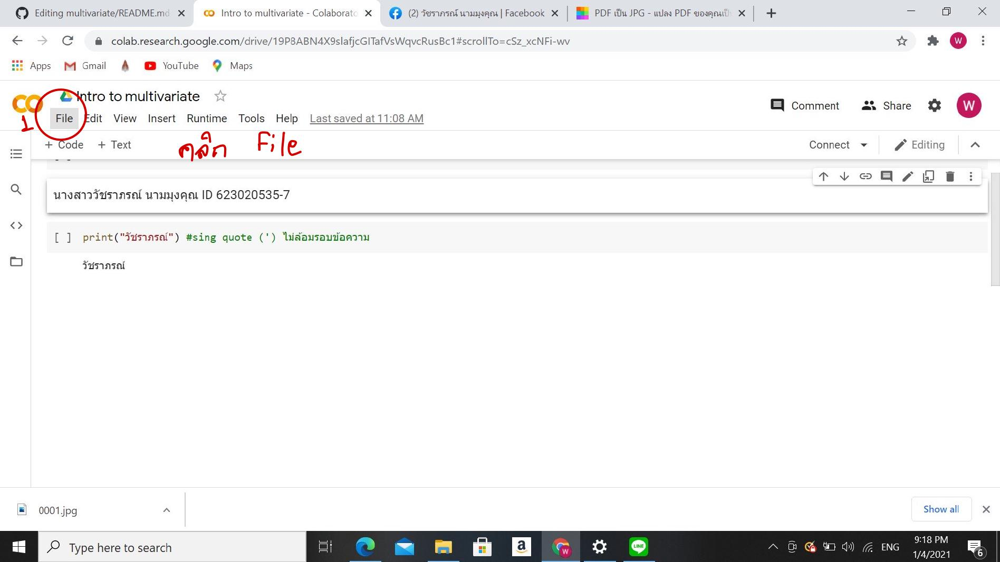
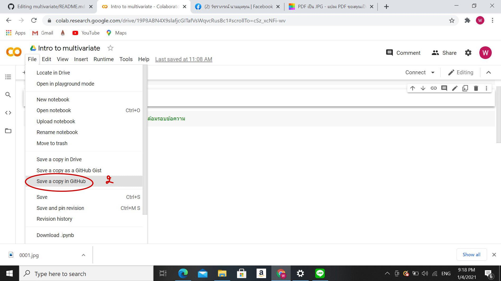
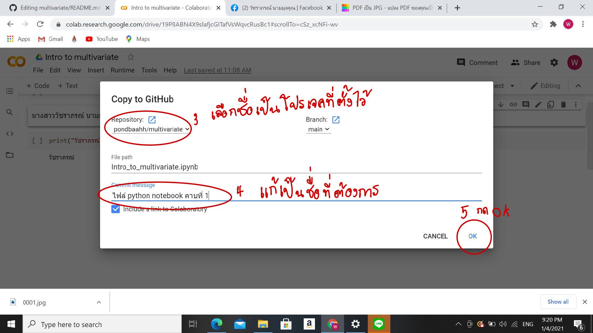

# multivariate

### วัชราภรณ์ นามมุงคุณ ID 623020535-7

.md => Markdown

[] square brackets

( ) parentheses

อธิบายการใช้งานGithub และ Google colab ว่าหน้าที่ของเเต่ละอันคืออะไรและอธิบายวิธีเซฟจาก Google colab ลง Github

อธิบายการใช้งานGithub

Github คือ เว็บไซต์ให้บริการบนออนไลน์แพลตฟอร์ม ทำให้สามารถเข้าถึงข้อมูลผ่านหน้าเว็บไซต์ได้ทุกที่ทุกเวลา
1. สมัครGithub 
2. หลังจากนั้นเราก็จะทำการสร้าง Repository ใน Github
3. พิมพ์ชื่อโปรเจคตามที่ต้องการ  และให้ติ๊กที่ Add a README file นั้นกดปุ่ม create
4. เริ่มเขียนโค้ดหรือแก้ไขโค้ดได้จากการกดรูปปากกาที่อยู่
5. ถ้าต้องการเเอดไฟล์รูปสามารถอัปโหลดก่อนแล้วมาเขียนโค้ด
6. ถ้าต้องการให้ตัวอักษรเล็กลงสามารถใช้ # ถ้าใช้เยอะตัวอักษรยิ่งเล็กลงเรื่อยๆ
7. สามารถดู Preview หลังจากเขียนโค้ดเสร็จ
8. เวลาจะออกทุกครั้งต้องกด commit changes ทุกครั้ง เพื่อเป็นการบันทึกและกลับมาแก้ไขงานภายหลังได้

อธิบายการใช้งาน  google colab   
Google Colab คือ Jupyter notebook ดัดแปลงที่รันอยู่บนคราวด์ และไม่จำเป็นต้องติดตั้งโปรแกรมใด ๆ ก่อนใช้งาน
ซึ่งทุกคนสามารถใช้งานได้ เพียงแค่มีบัญชี Google Drive เพื่อใช้ในการจัดเก็บตัวโค้ดเท่านั้น
โดยภาษา Python เป็นภาษาหลักที่ใช้ในการเขียนและรันงานบนเว็บ Colab 

1. พิมพ์ google colab
2. คลิ๊กเลือก google colab
3. เขียนโปรแกรม คลิกไฟล์ เลือก New notebook
4. ตั้งชื่อไฟล์ (ชื่อนักเรียน - ระดับชั้น - เลขที่)
5. พิมพ์ code  (ขึ้นข้อใหม่ ให้เลือก + Code)
6. run ผลลัพธ์
7. บันทึกไฟล์  Save (อย่าลืมบันทึกไฟล์บ่อยๆ นะคะ)
8. เปิดไฟล์งานที่เคยบันทึกไว้แล้ว 
     8.1 เข้าไปที่ google colab อีกครั้ง
     
     8.2  คลิกเลือกไฟล์ที่เคยบันทึกไว้แล้ว
     

อธิบายวิธีเซฟจาก Google colab ลง Github

